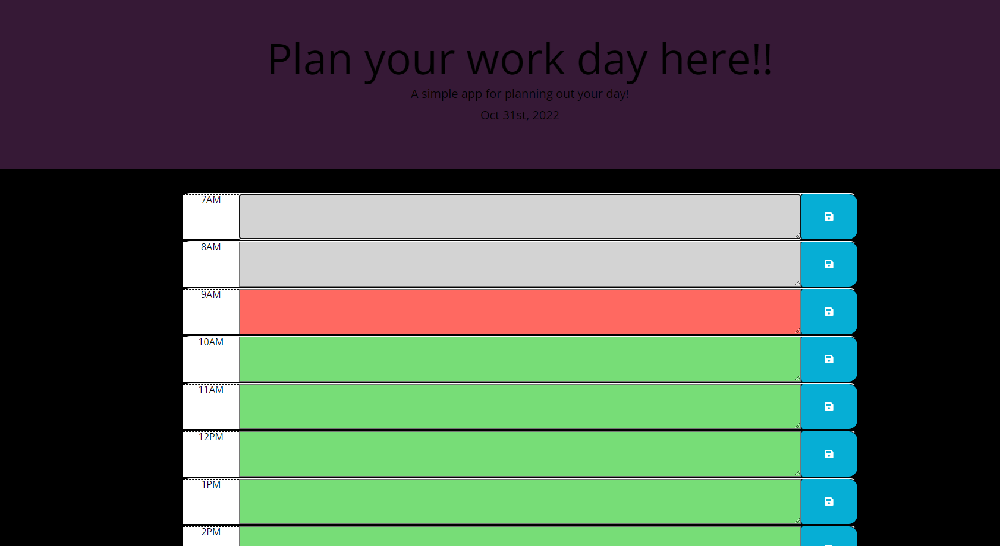

# Daily Planner
  

            
## Table of Contents:
1. [Description](#description)
2. [Installation](#installation)
3. [Usage](#usage)
4. [Contributing](#contributing)
5. [Tests](#tests)
6. [Questions](#questions)
7. [License](#license)

## Description:
This is a daily calendar for you to plan out everything you need to do in an average work day! the text blocks are colored and will update with the time of day so that you can easily see what textarea is in the past, present or future. When you add an item to the text area and click the save button on the right, this will save your entry into the localstorage and will stay on the page even after you refresh!          

## Installation:
N/A
            
## Usage:
You can use this application to help plan a busy day and make sure you get your tasks done on time and not forget anything!
            
## Contributing:
This was a solo project
            
## Tests:
N/A
    
## Questions:
Email: tylerbedard126@gmail.com

GitHub: 
[tbedard126](https://github.com/tbedard126)

Email is the best way to contact me
## License:

  MIT
  
  
  